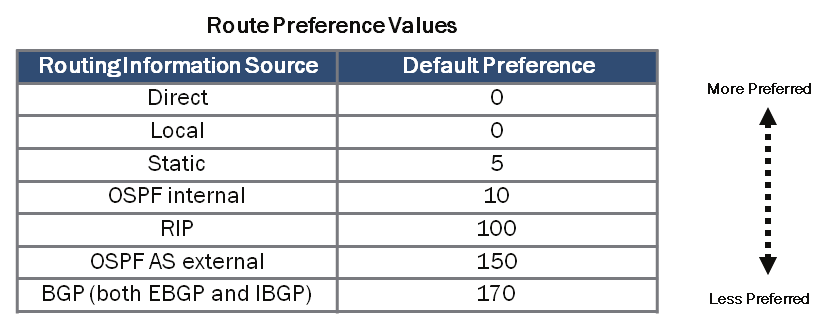
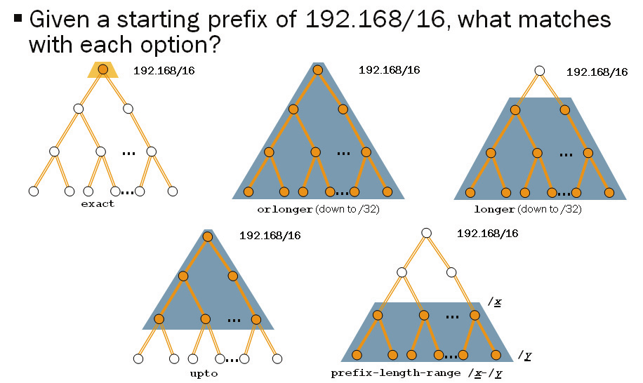

# Junos tables

## Default Route Preferences

| Protocol | Preferences | Protocol | Preferences |
|--|--|--|--|
| Direct | 0  | SNMP  | 50     |
|  Local | 0 |  Router discovery | 55 |
|  System routes  4| 4 |  RIP | 100 |
|  Static and Static LSPs |  5|  RIPng |  100 |
|  RSVP-signaled LSPs |  7|  DVMRP|  110|
| LDP-signaled LSPs |  9| Aggregate| 130|
|  OSPF internal | 10| OSPF AS external| 150|
|  IS-IS Level 1 internal|  15| IS-IS Level 1 external| 160|
|  IS-IS Level 2 internal|  18| IS-IS Level 2 external |  165|
|  Redirects |  30|   BGP (internal and external) |  170|
|  Kernel  |  40|   MSDP |  175|

## Route Preference Values

## junos_routing_tables

## match prefix
