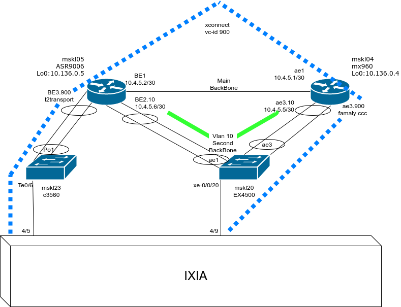

# psn-tunnel

Juniper

set protocols rsvp interface ae1.0

set protocols mpls interface ae1.0

set protocols ospf area 0.0.0.0 interface ae1.0 metric 100

set protocols ldp interface ae1.0

set protocols rsvp interface ae3.10

set protocols mpls interface ae3.10

set protocols ospf area 0.0.0.0 interface ae3.10 metric 1000

set protocols ldp interface ae3.10

set protocols mpls label-switched-path psn-ccc from 10.136.0.4

set protocols mpls label-switched-path psn-ccc to 10.136.0.5

set protocols mpls label-switched-path psn-ccc install 10.136.255.5/32

set protocols mpls label-switched-path psn-ccc revert-timer 600

set protocols mpls label-switched-path psn-ccc preference 10

set protocols mpls label-switched-path psn-ccc fast-reroute

set protocols mpls label-switched-path psn-ccc primary Button_path

set protocols mpls label-switched-path psn-ccc secondary loose_path

set protocols mpls path Button_path 10.4.5.6 strict

set protocols mpls path loose_path 10.136.0.5 loose

set protocols mpls interface lo0.0

set protocols mpls interface ae3.10

set protocols mpls interface ae1.0

set interfaces lo0 description "-M- mskl04 loopback0 ---"

set interfaces lo0 unit 0 family inet address 10.136.0.4/32

set interfaces ae1 unit 0 family inet address 10.4.5.1/30

set interfaces ae1 unit 0 family mpls

set interfaces ae3 unit 10 description "-B- 161114205400 mskl05 BE2.10 ---"

set interfaces ae3 unit 10 vlan-id 10

set interfaces ae3 unit 10 family inet mtu 9000

set interfaces ae3 unit 10 family inet address 10.4.5.5/30

set interfaces ae3 unit 10 family mpls

set interfaces ae3 unit 900 description "-AF 170829122900 EPL_via_RSVP ---"

set interfaces ae3 unit 900 encapsulation vlan-ccc

set interfaces ae3 unit 900 vlan-id 900

set interfaces ae3 unit 900 family ccc mtu 1554

 

set interfaces ae3 unit 901 description "-AF 170829122900 EPL_simple ---"

set interfaces ae3 unit 901 encapsulation vlan-ccc

set interfaces ae3 unit 901 vlan-id 901

set interfaces ae3 unit 901 family ccc mtu 1554

set protocols l2circuit neighbor 10.136.0.5 interface ae3.900 psn-tunnel-endpoint 10.136.255.5

set protocols l2circuit neighbor 10.136.0.5 interface ae3.900 virtual-circuit-id 900

set protocols l2circuit neighbor 10.136.0.5 interface ae3.900 control-word

set protocols l2circuit neighbor 10.136.0.5 interface ae3.900 ignore-encapsulation-mismatch

set protocols l2circuit neighbor 10.136.0.5 interface ae3.900 ignore-mtu-mismatch

set protocols l2circuit neighbor 10.136.0.5 interface ae3.901 virtual-circuit-id 901

set protocols l2circuit neighbor 10.136.0.5 interface ae3.901 control-word

set protocols l2circuit neighbor 10.136.0.5 interface ae3.901 ignore-encapsulation-mismatch

set protocols l2circuit neighbor 10.136.0.5 interface ae3.901 ignore-mtu-mismatch

=======================

lab@mskl04rb> show route 10.136.255.5

inet.3: 5 destinations, 6 routes (5 active, 0 holddown, 0 hidden)

+ = Active Route, - = Last Active, * = Both

10.136.255.5/32    *[RSVP/10/1] 2d 03:33:15, metric 101

                    > to 10.4.5.2 via ae1.0, label-switched-path psn-ccc

=======================

lab@mskl04rb> show mpls lsp 

Ingress LSP: 1 sessions

To              From            State Rt P     ActivePath       LSPname

10.136.0.5      10.136.0.4      Up     0       loose_path       psn-ccc

Total 1 displayed, Up 1, Down 0

Egress LSP: 1 sessions

To              From            State   Rt Style Labelin Labelout LSPname 

10.136.0.4      10.136.0.5      Up       0  1 SE       3        - mskl05_t10

Total 1 displayed, Up 1, Down 0

Transit LSP: 0 sessions

Total 0 displayed, Up 0, Down 0

///////////////////////////////////////////////////////////////////////////////////////////////////////////////////////////////

Cisco

interface Loopback0

 ipv4 address 10.136.0.5 255.255.255.255

!

interface Bundle-Ether2.10

 description -B- 161114205400 mskl04 ae3.10 ---

 mtu 9018

 ipv4 address 10.4.5.6 255.255.255.252

 load-interval 30

 encapsulation dot1q 10

!

interface Bundle-Ether1

 description -N- 161108160300 mskl04 ae1 ---

 mtu 9192

 service-policy output BB

 ipv4 address 10.4.5.2 255.255.255.252

 load-interval 30

!

interface Bundle-Ether3.900 l2transport

 description -AF 170829122900 EPL_via_RSVP ---

 encapsulation dot1q 900

 rewrite ingress tag pop 1 symmetric

 mtu 1554

!

interface Bundle-Ether3.901 l2transport

 description -AF 170829122900 EPL_Simple ---

 encapsulation dot1q 901

 rewrite ingress tag pop 1 symmetric

 mtu 1554

router ospf 1

 nsr

 log adjacency changes

 router-id 10.136.0.5

 bfd minimum-interval 150

 bfd multiplier 3

 auto-cost reference-bandwidth 100000

 area 0

  mpls traffic-eng

  interface Bundle-Ether1

   cost 100

  !

  interface Bundle-Ether2.10

   cost 1000

  !

  interface Loopback0

   passive enable

  !

interface tunnel-te10

 description -E- 1708292222 Tunnel mskl04 ---

 ipv4 unnumbered Loopback0

 load-interval 30

 logging events all

 logging events lsp-status state

 destination 10.136.0.4

 path-option 1 explicit name Button_lsp

 path-option 10 dynamic

explicit-path name Button_lsp

 index 1 next-address strict ipv4 unicast 10.4.5.5

l2vpn

 pw-class VLAN_MODE_balan_cw_te10

  encapsulation mpls

   control-word

   transport-mode vlan

   load-balancing

    flow-label both

   !

   preferred-path interface tunnel-te 10

 pw-class VLAN_MODE_balan_cw

  encapsulation mpls

   control-word

   transport-mode vlan

   load-balancing

    flow-label both

 xconnect group mskl04

  p2p vlan901_to_901

   interface Bundle-Ether3.901

   neighbor ipv4 10.136.0.4 pw-id 901

    pw-class VLAN_MODE_balan_cw

   !

   !

  !

  p2p vlan_900_to_900

   interface Bundle-Ether3.900

   neighbor ipv4 10.136.0.4 pw-id 900

    pw-class VLAN_MODE_balan_cw_te10

//////

interface Bundle-Ether2.10 

interface Bundle-Ether2.10 description -B- 161114205400 mskl04 ae3.10 ---

interface Bundle-Ether2.10 mtu 9018

interface Bundle-Ether2.10 ipv4 address 10.4.5.6 255.255.255.252

interface Bundle-Ether2.10 load-interval 30

interface Bundle-Ether2.10 encapsulation dot1q 10

router ospf 1 area 0 interface Bundle-Ether2.10 

router ospf 1 area 0 interface Bundle-Ether2.10 cost 1000

rsvp interface Bundle-Ether2.10 

mpls traffic-eng interface Bundle-Ether2.10 

mpls ldp interface Bundle-Ether2.10 

interface Bundle-Ether1 

interface Bundle-Ether1 description -N- 161108160300 mskl04 ae1 ---

interface Bundle-Ether1 mtu 9192

interface Bundle-Ether1 service-policy output BB

interface Bundle-Ether1 ipv4 address 10.4.5.2 255.255.255.252

interface Bundle-Ether1 load-interval 30

router ospf 1 area 0 interface Bundle-Ether1 

router ospf 1 area 0 interface Bundle-Ether1 cost 100

rsvp interface Bundle-Ether1 

mpls traffic-eng interface Bundle-Ether1 

mpls ldp interface Bundle-Ether1 

////////////////////////////////////////////////////////////////////////////////////////